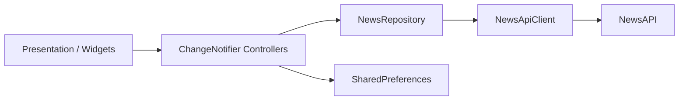

# NewsFlow

Aplicativo mobile de notícias desenvolvido em Flutter, com uma experiência realmente adaptativa: componentes Cupertino no iOS e Material Design 3 no Android. O projeto consome a [NewsAPI](https://newsapi.org/), organiza manchetes por categoria e país e oferece pesquisa, favoritos offline e preferências persistentes.

> O objetivo deste projeto foi ir além de uma simples tela consumindo uma API. A implementação separa apresentação, domínio e acesso a dados, trata estados assíncronos e falhas de rede, preserva o estado de navegação e mantém uma interface coerente com cada plataforma.

## Principais recursos

- Manchetes por país e por sete categorias: geral, negócios, entretenimento, saúde, ciência, esportes e tecnologia.
- Pesquisa textual com debounce de 500 ms, controle de requisições concorrentes e paginação incremental.
- Infinite scroll com deduplicação de artigos pela URL.
- Pull to refresh usando `RefreshIndicator` no Android e `CupertinoSliverRefreshControl` no iOS.
- Estratégia de fallback: se `/top-headlines` não retornar resultados, o repositório cria uma consulta localizada para `/everything`.
- Tela de detalhes com compartilhamento, favoritos e abertura segura da publicação no navegador externo.
- Favoritos serializados em JSON e persistidos localmente com `SharedPreferences`.
- Tema claro, escuro ou definido pelo sistema, escala de texto configurável e seleção do país padrão.
- Imagens remotas com cache e fallback visual.
- Estados explícitos de carregamento, sucesso, lista vazia, paginação e erro.
- Mensagens específicas para timeout, ausência de conexão, limite de requisições e chave inválida.

## Arquitetura

O código está organizado por features e aplica separação de responsabilidades entre UI, gerenciamento de estado, domínio e infraestrutura.



- **Presentation:** telas, cards e widgets adaptativos observam apenas o estado necessário por meio de `context.watch`, `context.read` e `context.select`.
- **State management:** controllers baseados em `ChangeNotifier` concentram carregamento, paginação, busca, favoritos e configurações.
- **Domain:** `Article`, `NewsPage` e `NewsFeed` representam as entidades e o estado do feed sem dependência da interface.
- **Data:** `NewsApiClient` encapsula HTTP e parsing; `NewsRepository` define o contrato e `RemoteNewsRepository` implementa a estratégia remota e o fallback de conteúdo.
- **Dependency injection:** `MultiProvider` e `ProxyProvider` montam e distribuem `Dio`, cliente HTTP, repositório e controllers a partir do ponto de entrada.

### Fluxo de dados

1. A tela solicita uma ação ao controller, como atualizar, pesquisar ou carregar a próxima página.
2. O controller consulta a abstração `NewsRepository` e publica um novo estado para a UI.
3. O repositório decide entre manchetes e a busca de fallback.
4. O cliente HTTP envia a chave no header `X-Api-Key`, valida a resposta e converte o JSON em objetos de domínio.
5. Exceções do `Dio` são traduzidas para mensagens compreensíveis pela interface.

## UI adaptativa

A adaptação não se limita a cores ou ícones. O `AdaptivePlatformScope` centraliza a plataforma atual e permite sobrescrevê-la durante testes.

| Experiência | iOS | Android |
| --- | --- | --- |
| Aplicação | `CupertinoApp.router` | `MaterialApp.router` |
| Estrutura de página | `CupertinoPageScaffold` | `Scaffold` |
| Navegação principal | `CupertinoTabScaffold` | Material 3 `NavigationBar` |
| Pesquisa | `CupertinoSearchTextField` | `SearchBar` |
| Atualização | `CupertinoSliverRefreshControl` | `RefreshIndicator` |
| Feedback | Cupertino dialogs/action sheets | dialogs/snackbars Material |

A navegação usa `go_router` com `StatefulShellRoute.indexedStack`, mantendo o estado independente das quatro áreas principais: Início, Pesquisa, Favoritos e Ajustes.

## Estrutura do projeto

```text
lib/
├── app/
│   ├── app.dart                 # Bootstrap visual Material/Cupertino
│   ├── router.dart              # Rotas e navegação adaptativa
│   └── theme.dart               # Temas das duas plataformas
├── core/
│   ├── adaptive/                # Detecção de plataforma e widgets adaptativos
│   ├── config/                  # Exemplo de configuração da API key
│   └── network/                 # Tradução de falhas HTTP
└── features/
    ├── news/
    │   ├── data/                # Cliente NewsAPI e repository
    │   ├── domain/              # Entidades e modelos de estado
    │   └── presentation/        # Controllers, telas e componentes
    ├── favorites/               # Estado e persistência dos favoritos
    └── settings/                # Preferências de aparência e conteúdo
```

## Tecnologias e decisões técnicas

| Tecnologia | Uso no projeto |
| --- | --- |
| Flutter / Dart | Aplicação multiplataforma e UI adaptativa |
| Provider | Injeção de dependências e gerenciamento de estado |
| Dio | Requisições HTTP, timeouts e tratamento de erros |
| go_router | Rotas declarativas e estado das abas |
| SharedPreferences | Persistência de favoritos e configurações |
| cached_network_image | Cache e tratamento de imagens remotas |
| share_plus | Compartilhamento nativo de matérias |
| url_launcher | Abertura da fonte original no navegador |
| intl | Formatação local de data e hora |

## Como executar

### Pré-requisitos

- Flutter com Dart SDK compatível com `^3.12.1`.
- Android Studio ou Xcode configurado para a plataforma desejada.
- Uma chave de desenvolvimento da [NewsAPI](https://newsapi.org/register).

### Configuração

```bash
git clone <URL_DO_REPOSITORIO>
cd newsflow
flutter pub get
cp lib/core/config/api_keys.example.dart lib/core/config/api_keys.dart
```

Edite `lib/core/config/api_keys.dart`:

```dart
abstract final class ApiKeys {
  static const newsApiKey = 'SUA_CHAVE_DA_NEWSAPI';
}
```

Em seguida, execute:

```bash
flutter run
```

O arquivo `api_keys.dart` está no `.gitignore` para evitar o commit acidental da credencial.

> **Nota de segurança:** aplicações mobile não conseguem manter segredos no binário. Em um ambiente de produção, o acesso à NewsAPI deve passar por um backend proxy, onde a chave possa ser armazenada com segurança. Também é necessário utilizar um plano da NewsAPI compatível com produção.

## Qualidade e testes

A suíte usa doubles locais e `SharedPreferences` em memória, sem depender de internet ou de uma chave real. Ela verifica:

- parsing de campos opcionais e serialização de artigos favoritos;
- bloqueio de chamadas sem API key;
- comportamento do repositório e consulta de fallback localizada;
- seleção de `CupertinoApp`/`MaterialApp` e das respectivas estruturas de navegação;
- renderização adaptativa do campo de pesquisa.

```bash
dart format --set-exit-if-changed lib test
flutter analyze
flutter test
```

## Gerando builds

```bash
# Android
flutter build apk

# iOS (requer macOS e Xcode)
flutter build ios
```

## Limitações conhecidas

- O plano Developer da NewsAPI é destinado a desenvolvimento e testes.
- A NewsAPI pode retornar o conteúdo do artigo truncado; por isso o app direciona para a publicação original.
- Os favoritos ficam disponíveis offline, mas os feeds dependem de conexão com a API.

---

Desenvolvido como estudo prático de arquitetura Flutter, consumo de API REST, persistência local, gerenciamento de estado e design adaptativo.
